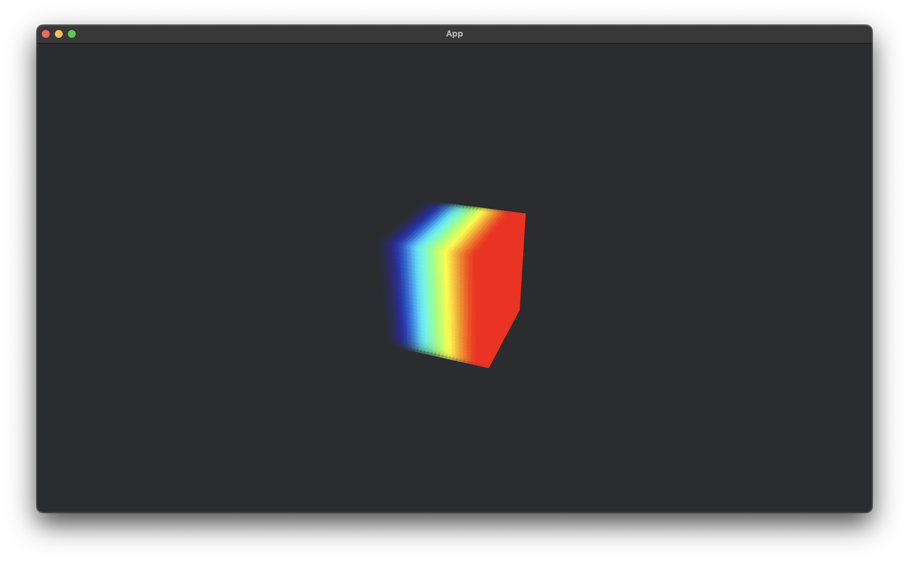
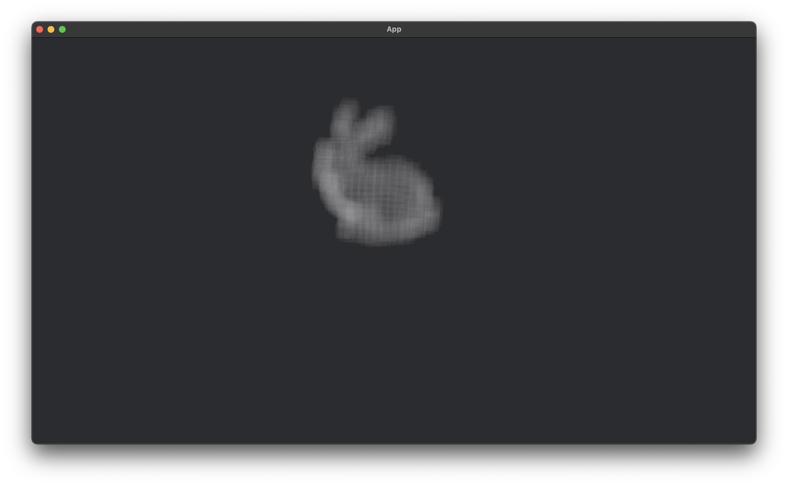

# Bevy Voxel Plot

[](https://crates.io/crates/bevy_voxel_plot)
[](https://docs.rs/bevy_voxel_plot)
[](https://github.com/hacknus/bevy_voxel_plot/actions/workflows/rust.yml)

A simple and efficient Voxel Plot for [Bevy](https://bevyengine.org).
Developed for data visualisation purposes (e.g. pointclouds/voxelplots of 3D structures).

It uses instancing and is an adaptation of the
`custom_shader_instancing.rs` [example of bevy](https://github.com/bevyengine/bevy/blob/main/examples/shader/custom_shader_instancing.rs)
which also supports opacity control.

Able to plot 2 million voxels on an M2Pro Macbook Pro.




## Examples:

```shell
cargo run --release --examples bevy_egui
```

- Bevy Pan Orbit Camera

Simple implementation of the Voxel Plot along with the `bevy_panorbit_camera` crate.

- Bevy Egui

More advanced implementation of the Voxel Plot along with the `bevy_panorbit_camera` crate inside an `egui` image
texture, implemented with the `bevy_egui` crate.

- Bevy Pointcloud Bunny

Load the test file `bunny.pcd` from [pcl](https://github.com/PointCloudLibrary/pc) and display it as colorful voxels with
low alpha.

## Version Compatibility

| bevy | bevy_voxel_plot |
|------|-----------------|
| 0.16 | 2.0             |
| 0.15 | 1.0             |

## Credits

- [Bevy](https://bevyengine.org)
- [bevy_egui](https://github.com/vladbat00/bevy_egui)
- [bevy_panorbit_camera](https://github.com/Plonq/bevy_panorbit_camera)
- [pcl](https://github.com/PointCloudLibrary/pc)
